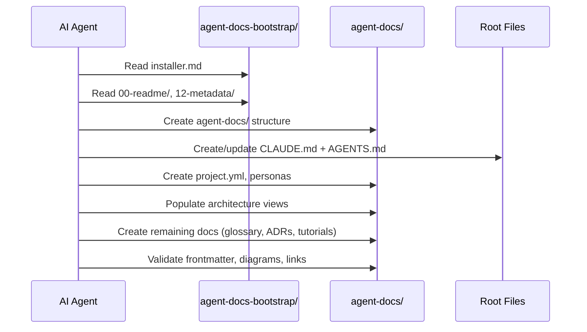
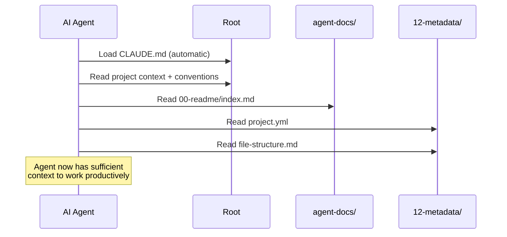
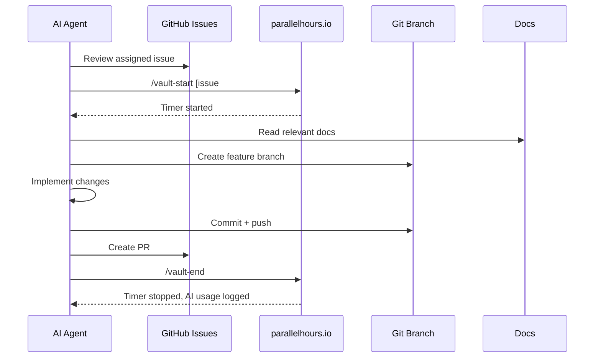

# Runtime Architecture

parallel-powers is primarily a documentation and conventions framework, not a running system. Its "runtime" is the workflow patterns agents and humans follow.

## Critical Sequence: Project Initialization

When a new project is initialized with the bootstrap kit:

## Critical Sequence: Agent Onboarding

When an agent starts a new session:

## Critical Sequence: Issue-Driven Workflow

A typical day-in-the-life:

## Error Handling

Since this is a documentation framework, "errors" are primarily:

- **Missing frontmatter**: Documents won't be indexable by agents
- **Broken links**: Navigational failures within agent-docs/
- **Stale docs**: Outdated metadata (status, version, dates)
- **Inconsistent personas**: Personas that don't reference actual docs

Agents should validate these as part of any documentation workflow.
