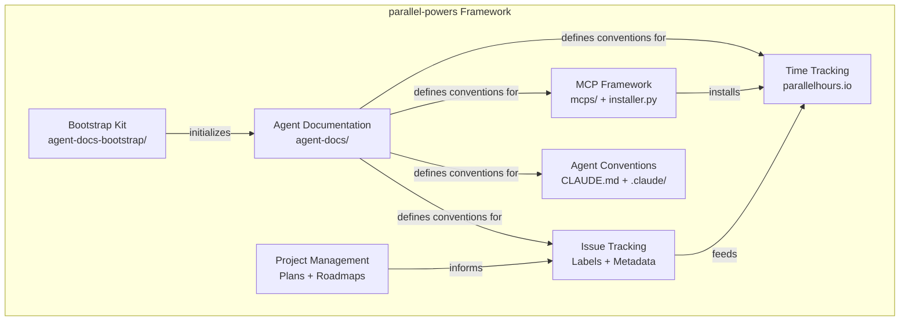

# Subsystem Architecture

parallel-powers is a meta-framework. Its subsystems are primarily conceptual and procedural rather than software modules.

## Subsystem Overview

## Subsystem Responsibilities

| Subsystem | Responsibility |
|-----------|---------------|
| **Agent Documentation** | Diátaxis-structured docs that guide agents and humans |
| **Bootstrap Kit** | Template/installer for initializing the docs kit in new projects |
| **Issue Tracking** | GitHub labels and metadata for agile project management |
| **MCP Framework** | Optionally installable MCP servers (`mcps/`) with a unified installer (`installer.py`) |
| **Time Tracking** | Session-based time tracking via parallelhours.io (optional, installed via MCP Framework) |
| **Project Management** | Plans, roadmaps, sprint tracking |
| **Agent Conventions** | Claude Code instructions, hooks, commands, MCP config |

## Key Relationships

- The **Bootstrap Kit** produces an **Agent Documentation** instance
- **Agent Documentation** defines the conventions used by **Issue Tracking** and **Time Tracking**
- **Project Management** creates plans that are tracked via **Issue Tracking** issues
- **Agent Conventions** control how agents interact with all other subsystems

## Boundaries and Interfaces

- `agent-docs-bootstrap/` is the template — it should never be edited for project-specific content
- `agent-docs/` is the live instance — all project-specific documentation lives here
- `CLAUDE.md` at the root is the agent's entry point; it points to `agent-docs/` for deeper context
- Issue labels follow a strict naming convention defined in `04-reference/issue-labels.md`
