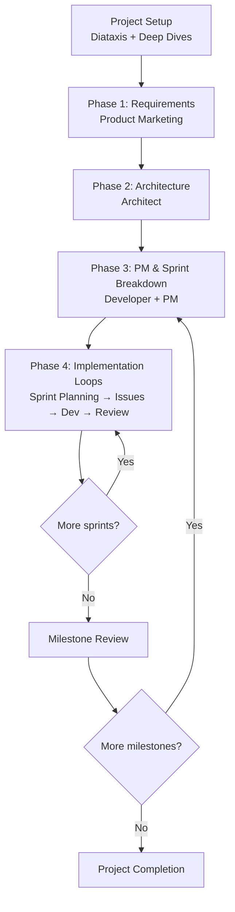
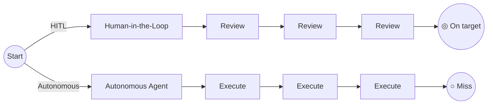

# Tutorial: AI-Assisted Project Development — Human in the Loop

The single most important pattern in AI-assisted development is the
**human-in-the-loop cadence**: a structured, recursive process where every
step is guided by a human and executed with AI assistance. It scales from a
three-minute bug fix all the way up to a six-month project delivery.

This tutorial walks through the full macro-process, shows how each persona
participates, and introduces **shrink to fit** — the principle that lets you
apply the same pattern at any scale.

## What Is the Human-in-the-Loop Cadence?

Most AI-assisted development falls into one of two traps: either the human
micromanages every keystroke (defeating the purpose of AI assistance), or the
human steps away entirely and the agent drifts. The human-in-the-loop cadence
avoids both by defining clear handoff points where human judgment is required
and AI autonomy is bounded.

The cadence follows this macro-structure:

Every box is **human-in-the-loop** — the human approves outputs, makes
decisions, and sets direction. The AI executes, drafts, and accelerates.

### Why Human-in-the-Loop?

A critical goal of the human-in-the-loop pattern is to **catch divergence from
goals early**. When an agent runs unchecked, ambiguity in requirements
compounds: a vague PRD phrase becomes a misunderstood architecture decision,
which becomes an incorrectly implemented feature, surfacing as a bug weeks
later. Each step amplifies the original ambiguity — small gaps in early
requirements expand into costly rework.

Human-in-the-loop takes more time per step, but it lets the human **course
correct early and often** — filling gaps, flagging misunderstandings, and
adjusting direction before work is merged.

Even though the HITL path has more steps (review checkpoints), it converges on
the goal because each review is a chance to steer back to center. The
autonomous path appears faster per step but drifts further with every unchecked
decision.

### Cost Containment

Quality isn't the only reason to keep humans in the loop. **AI usage is a
direct operating cost**, and unchecked autonomous agents are unchecked spend.
Every prompt, every large context window, every multi-step chain of agent calls
appears on your invoice. A solo developer experimenting with AI feels this at a
small scale; an engineering organization running dozens of autonomous agents
feels it immediately.

The human-in-the-loop cadence creates natural cost pressure by design:

**Humans take on what they're better at.** Not every task benefits from AI
generation. Reviewing a two-line config change, writing a one-sentence
changelog entry, or renaming a variable are tasks a human completes in seconds
— an AI completes them in thousands of tokens. The cadence surfaces these
opportunities: when a human is already reviewing output, they can simply fix
the small things themselves rather than round-tripping to the agent.

**Scope boundaries contain consumption.** Sprints are fixed scope. When each
sprint has a defined goal and a human must approve before the next begins, AI
consumption is bounded per cycle. There are no runaway agent loops spending
tokens on work that was never approved.

**The right tool for the right task.** The cadence makes the AI-vs-human
decision explicit at every step. Complex reasoning, large-scale generation,
and cross-file refactors are where AI delivers outsized leverage. Mechanical
tasks, judgment calls, and stakeholder communication are where humans are
faster and cheaper. A well-run HITL workflow routes each task accordingly.

**Organizational resilience against AI dependency.** This is the longer-term
cost argument: teams that run fully autonomous pipelines accumulate hidden
risk. If a model is deprecated, a provider raises prices, an API changes
behavior, or leadership decides to shift tools, the team has no fallback —
they've lost the institutional knowledge of how to do the work without the
AI. Human-in-the-loop keeps engineers engaged with the codebase, the
architecture, and the decisions being made. That knowledge doesn't disappear
if the AI does. It also means the team can intelligently evaluate when the
next model generation actually improves their workflow — rather than being
locked in by dependency.

The goal is not to minimize AI usage — it's to **maximize value per dollar
spent**. Human-in-the-loop is the mechanism that keeps that ratio in check.

## The Core Principle: Shrink to Fit

The cadence above looks heavyweight for a single bug fix. That's where
**shrink to fit** comes in: the same process applies at every scale, but the
phases collapse or compress based on context.

| Scale | Example | How the Cadence Shrinks |
|-------|---------|------------------------|
| **Full project** | New product launch | Full six-phase cadence |
| **Feature** | Add payment integration | Phases 1-3 are quick conversations; Phase 4 is one sprint |
| **Bug fix** | Fix login crash | Phase 1 = "here's the bug", Phase 2 = "here's the fix", Phase 3-4 = one task, Phase 5 = merged |
| **Typo** | Fix a docs typo | The entire cadence is a single prompt: "Fix typo on line 42. Verify with the project's lint command." |

The invariant is always **human approval at each boundary**. The content
changes; the structure stays.

## Phase 0: Project Setup

*Applies to: new projects or brownfield projects without existing agent docs.*

Before the cadence can run, the project needs:

- A **Diataxis documentation structure** — the agent-docs layout
  (`00-readme/` through `13-personas/`)
- **Deep dives** on the existing codebase, architecture, conventions
- **Persona definitions** for the roles that will participate in the cadence

If this setup is already complete, skip to Phase 1. Otherwise, run a bootstrap
session to initialize the structure, then run deep-dive sessions with the
Architect and Developer personas to populate the explanation and reference docs.

## Phase 1: Requirements

*Persona: Product Marketing*

The Product Marketing persona owns this phase. Their job is to produce a
requirements document (PRD) that captures:

- **Context**: What problem are we solving? For whom? Why now?
- **Requirements**: Functional and non-functional, with acceptance criteria
- **Prioritization**: Impact vs. effort, strategic alignment, customer value
- **Success criteria**: How will we know this is done?

> **In practice**: Describe the project or feature to the agent using the
> Product Marketing persona. The agent will ask clarifying questions, then
> produce a structured PRD. Review and approve before moving on.

**Deliverable**: Approved PRD.

## Phase 2: Architecture

*Persona: Architect*

The Architect persona takes the approved requirements and produces:

- System architecture / component breakdown
- Technology decisions (or validates existing ones)
- Key interfaces and data flow
- Architecture Decision Records (ADRs) for significant choices

> **In practice**: Hand the requirements to the agent using the Architect
> persona. Review the architecture proposal, debate trade-offs, and approve
> before moving on.

**Deliverable**: Architecture document + ADRs (`01-explanation/architecture-*.md`,
`01-explanation/decisions/`).

## Phase 3: Project Management & Sprint Breakdown

*Personas: Developer + Project Manager*

The Developer and Project Manager personas work together to turn requirements
and architecture into a plan:

1. **Task breakdown**: Decompose the work into discrete, estimatable tasks
2. **Estimates**: Each task gets two estimates:
   - **Human hours**: Time without AI assistance (traditional estimate)
   - **AI-assisted hours**: Time with AI agent assistance
3. **Sprint definition**: Group tasks into sprints achievable in "long
   sessions" with the AI. Each sprint should have a clear goal and
   deliverable.
4. **Project management document**: A plan showing:
   - Project flow and dependencies
   - Milestones (groups of sprints)
   - Human vs. AI-assisted date estimates
   - Sprint timelines (Gantt-style)
   - Risk areas where human judgment is critical

> **In practice**: The agent drafts the full PM document. Review the estimates
> — debate any AI estimate that seems too aggressive or too conservative.
> Approve the sprint structure before implementation begins.

**Deliverable**: Approved project management plan (`05-plans/roadmap.md`,
`05-plans/sprint-backlog.md`, `05-plans/pm-plan.md`).

## Phase 4: Implementation Loops

*Personas: Developer + Project Manager*

This is where the actual work happens, one sprint at a time.

### Sprint Planning

At the start of each sprint, the Developer and PM personas:

- Review sprint goal and backlog
- Create **stories / issues** for every task
- Assign estimates, priorities, and labels
- Confirm tests are included in every task definition

### Trust-Based Delegation

The human decides how much autonomy to give the agent based on accumulated
trust:

| Trust Level | Delegation Scope | Review Cadence |
|-------------|-----------------|----------------|
| **Low** | Single task per prompt | Review every output |
| **Medium** | Group of related issues | Review after each group |
| **High** | Entire sprint | Sprint review at end |

Start low. As the agent demonstrates understanding of the project's
conventions, code style, and testing patterns, widen the scope.

### Implementation

Every task follows the same pattern:

1. **Branch**: Create a feature branch from `main` — never push directly
2. **Implement**: Agent writes code following project conventions
3. **Test**: Unit and integration tests (included in the task definition)
4. **Review**: AI-augmented code review
   - **Initially**, the human reviews every PR. They may use an AI from a
     **different LLM provider** than the one that wrote the code to get an
     independent second opinion. Treat the AI as an **enhanced reviewer** that
     flags issues for the human to evaluate — not an authority that replaces
     human judgment.
   - **As trust builds**, the human can delegate review responsibility: first
     letting AI approve routine changes (docs, refactors with tests), then
     broader changes, eventually allowing fully AI-conducted reviews and
     approvals.
   - **Code review guidelines** must be written into the agent's instructions
     (e.g., `AGENTS.md`, `CLAUDE.md`, or the project's review template).
     Guidelines should cover: correctness, test coverage, style consistency,
     security, performance, and documentation. The agent should cite the
     specific guideline when flagging or approving each issue.
5. **Merge**: Squash-merge to `main` after approval

> **In practice**: Use the parallelhours.io time tracking integration
> (`/parallel-powers:session-start [issue#]` and `/parallel-powers:session-end`)
> to log AI-assisted time automatically. Each task is tracked separately so you
> can compare human estimates vs. actual AI-assisted time.

### Sprint Review

At the end of every sprint, the agent generates a **sprint review**:

- What was completed (vs. planned)
- What was not completed and why
- Time tracked (human vs. AI-assisted)
- Any blockers or risks for the next sprint
- Updated estimates for remaining work

The human reviews, adjusts the backlog, and approves moving to the next
sprint.

**Deliverable**: Completed features in `main`, sprint review document.

## Phase 5: Milestone Reviews

After several sprints, a milestone completes. Milestone reviews are more
substantial than sprint reviews:

- **Demo**: What was built (working software or documentation)
- **Metrics**: Human vs. AI-assisted time across all sprints, estimate
  accuracy, velocity trend
- **Retrospective**: What worked, what didn't, what to change
- **Updated roadmap**: Remaining milestones re-estimated based on actual
  velocity

The human and agent present the review together. This is a key trust-building
moment — consistent milestone deliveries justify wider delegation in future
phases.

**Deliverable**: Milestone review document, updated roadmap.

## Phase 6: Project Completion

The final phase ties everything together:

- Final delivery of all milestones
- Project retrospective (what went well, what to improve next time)
- Knowledge base updates (updated docs, ADRs, personas)
- Close-out metrics (total human time, total AI-assisted time, velocity,
  estimate accuracy)

## Putting the Cadence Together

Here's how a full project might look end-to-end:

| Week | Phase | Activity | Human Role |
|------|-------|----------|------------|
| 1 | Setup | Bootstrap docs, deep dives | Guide deep dives |
| 2-3 | Requirements + Architecture | PRD, ADRs, architecture docs | Review and approve |
| 4 | PM Sprint Breakdown | Task breakdown, estimates, sprint plan | Debate estimates, approve plan |
| 5-6 | Sprint 1 | Sprint planning, implementation, review | Daily check-ins, sprint review |
| 7-8 | Sprint 2 | Sprint planning, implementation, review | Daily check-ins, sprint review |
| 9 | Milestone 1 Review | Demo, metrics, retro | Present with agent |
| 10-16 | Sprints 3-6 | Repeat sprint pattern | Trust level increases |
| 17 | Milestone 2 Review | Demo, metrics, retro | Present with agent |
| 18 | Completion | Final delivery, project retro | Close out |

Remember: **shrink to fit**. A bug fix skips weeks 1-4 entirely. A feature
add compresses weeks 1-3 to a single conversation. Only full projects run
the entire table.

## Personas Reference

Each phase of the cadence is owned by one or more personas. Personas are
detailed character definitions — background, goals, pain points, how they
communicate — that you give to the agent before a phase begins. Switching
personas shifts the agent's perspective and focus without changing the
underlying model.

| Persona | Name | Phase | What they own |
|---------|------|-------|---------------|
| **Product Marketing** | Taylor | Phase 1 | PRD, problem framing, success criteria, prioritization |
| **Architect** | Amara | Phase 2 | System design, technology decisions, ADRs, component breakdown |
| **Project Manager** | Morgan | Phase 3–4 | Sprint planning, task breakdown, estimates, milestone tracking |
| **Developer** | Wei | Phase 3–4 | Implementation, tests, code review, branch and merge workflow |
| **Docs Author** | Yuki | Throughout | Documentation structure, templates, reference material, tutorials |
| **Editorial Reviewer** | Emery | Throughout | Inclusive language, clarity, accuracy across all content types |
| **Evaluator** | Sam | Pre-adoption | Framework fit assessment, integration effort, adoption readiness |
| **Operator** | Jordan | Setup + ongoing | GitHub configuration, issue labels, MCP servers, CI/CD pipelines |
| **Junior Developer** | Hikaru | Phase 3–4 | Onboarding path, learning scaffolding, step-by-step guidance |
| **Legal & Contracts** | Morgan Ellis | As needed | AI adoption proposals, contracts, training scopes, PoC boundaries |

Personas work best when introduced explicitly at the start of a conversation:
> "You are Taylor, the Product Marketing persona for this project. Here is the
> persona definition: [paste persona]. Now let's work on the PRD for..."

## Key Artifacts

Each phase produces a concrete deliverable. These are the canonical documents
the cadence relies on:

| Artifact | Phase | Purpose |
|----------|-------|---------|
| **PRD** (Product Requirements Document) | 1 | Captures problem, requirements, acceptance criteria, and success metrics |
| **Architecture document** | 2 | System design, component breakdown, technology decisions |
| **ADRs** (Architecture Decision Records) | 2 | Rationale for significant technical choices |
| **PM plan** | 3 | Sprint structure, milestones, estimates (human vs. AI-assisted), Gantt timeline |
| **Sprint backlog** | 3–4 | Task list with story points, labels, and priority for each sprint |
| **Stories / issues** | 4 | Individual tasks with acceptance criteria, estimates, and test requirements |
| **Sprint review** | 4 | Completed vs. planned, time tracked, blockers, updated estimates |
| **Milestone review** | 5 | Demo, metrics, retrospective, updated roadmap |
| **Project retrospective** | 6 | Final metrics, lessons learned, updated docs and personas |

The cadence is the structure. The personas are the judgment. The artifacts are
the receipts — the evidence that each phase completed with human approval before
the next began.
