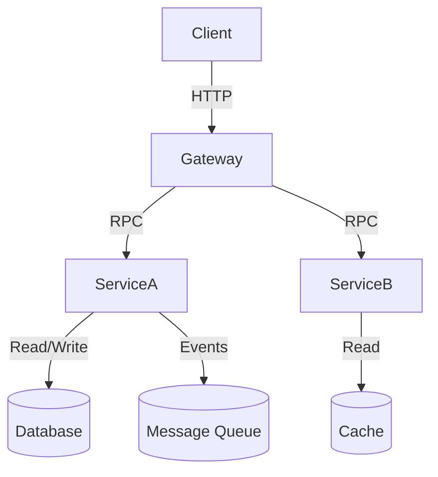
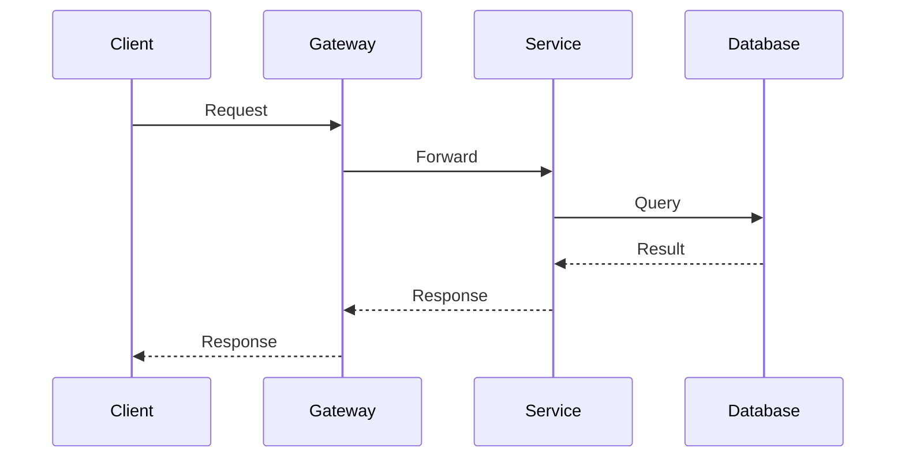
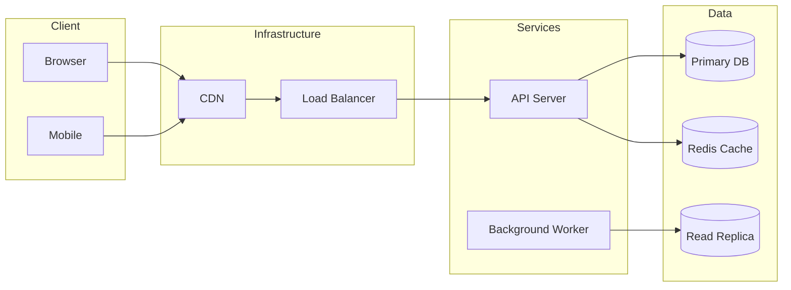
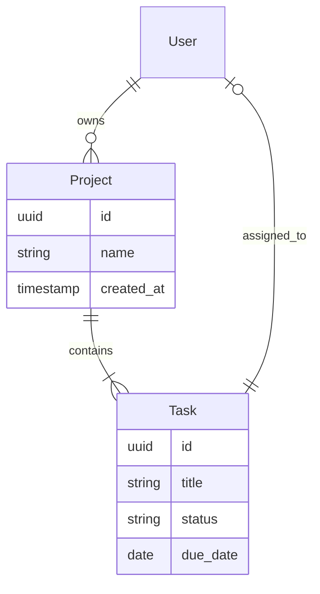
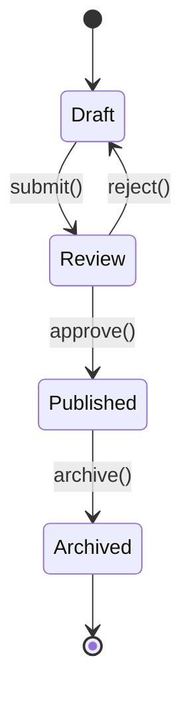
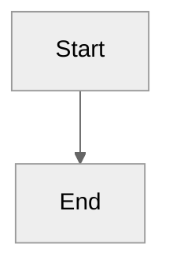

# Diagram Conventions

This project uses two diagram types: ASCII for simple structures, Mermaid for complex diagrams.

## When to Use ASCII

ASCII diagrams are preferred for:

- File system structures
- Directory trees
- Simple flowcharts
- CLI output examples
- Code snippets with annotations

### File System Structure

Use this format:

```
project/
├── src/
│   ├── index.ts       # Entry point
│   └── utils/
│       ├── helpers.ts
│       └── format.ts
├── tests/
│   └── index.test.ts
└── docs/
    └── index.md
```

### Simple Flowcharts

```
START → CHECK INPUT → [valid] → PROCESS → END
                     ↘
                      [invalid] → ERROR → END
```

### Code Annotations

```python
def process(data):     # ← Function receives data
    result = []         # ← Initialize result array
    for item in data:   # ← Iterate over items
        result.append(item * 2)
    return result       # ← Return transformed data
```

## When to Use Mermaid

Mermaid diagrams are for:

- Architecture diagrams
- Component relationships
- Sequence diagrams
- Runtime behavior
- State machines
- Class/entity relationships

### Component Diagram



### Sequence Diagram



### Runtime/Deployment Diagram



### Entity Relationship



### State Diagram



## Mermaid Configuration

Render with dark/light theme support:



## Guidelines

1. **Accessibility**: Provide text alternatives for complex diagrams. Add an `aria-label` or a prose summary before/after every diagram so screen readers and text-only contexts can understand the content. For Mermaid, consider a short paragraph below the diagram describing what it shows. For ASCII diagrams, a one-sentence caption is usually sufficient. Example:

   ```markdown
   <!-- Prose summary before a diagram -->
   The diagram below shows the request flow: a client sends an HTTP request
   to the gateway, which routes it to the appropriate service.

   ![Flow diagram: Client → Gateway → Service → Database]
   ```
2. **Consistency**: Use same style across related diagrams
3. **Simplicity**: Prefer ASCII for simple, Mermaid for complex
4. **Testing**: Verify diagrams render correctly in target format

## Tool Support

| Tool | ASCII | Mermaid |
|------|-------|---------|
| GitHub | ✓ | ✓ |
| GitLab | ✓ | ✓ |
| VS Code | ✓ | ✓ (with extension) |
| MkDocs | ✓ | ✓ (with plugin) |
| VitePress | ✓ | ✓ |
